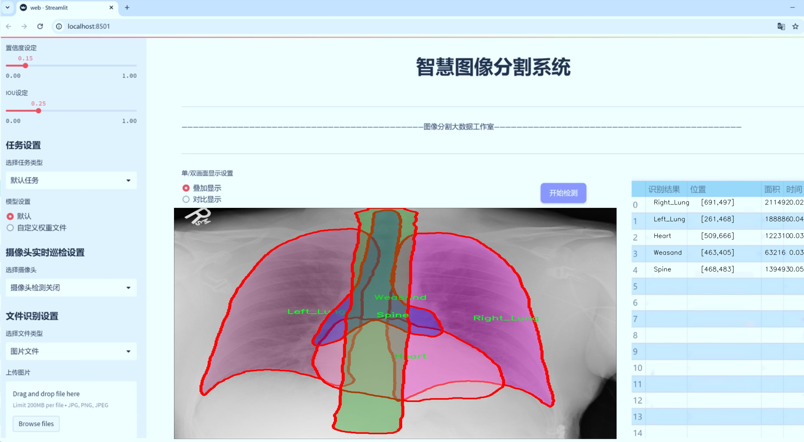
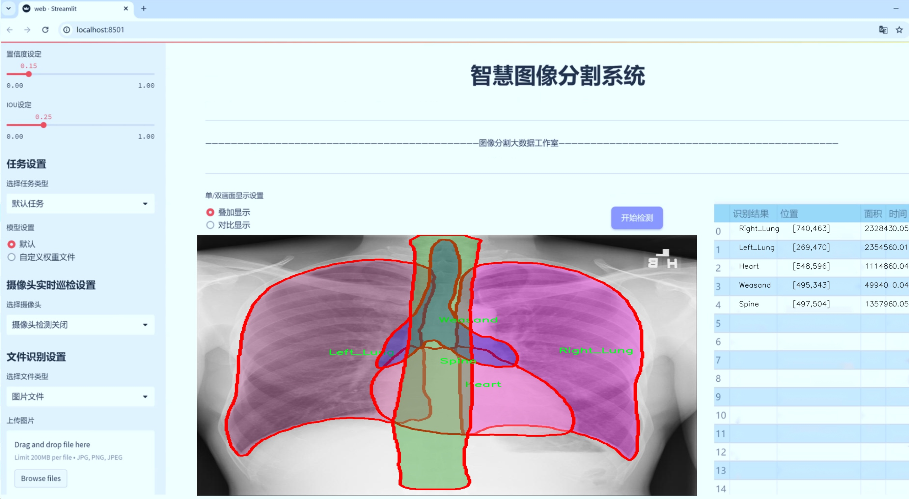
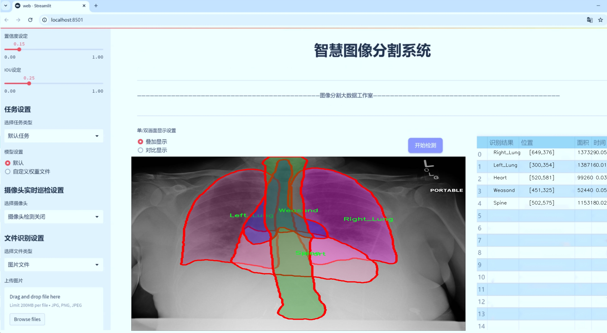
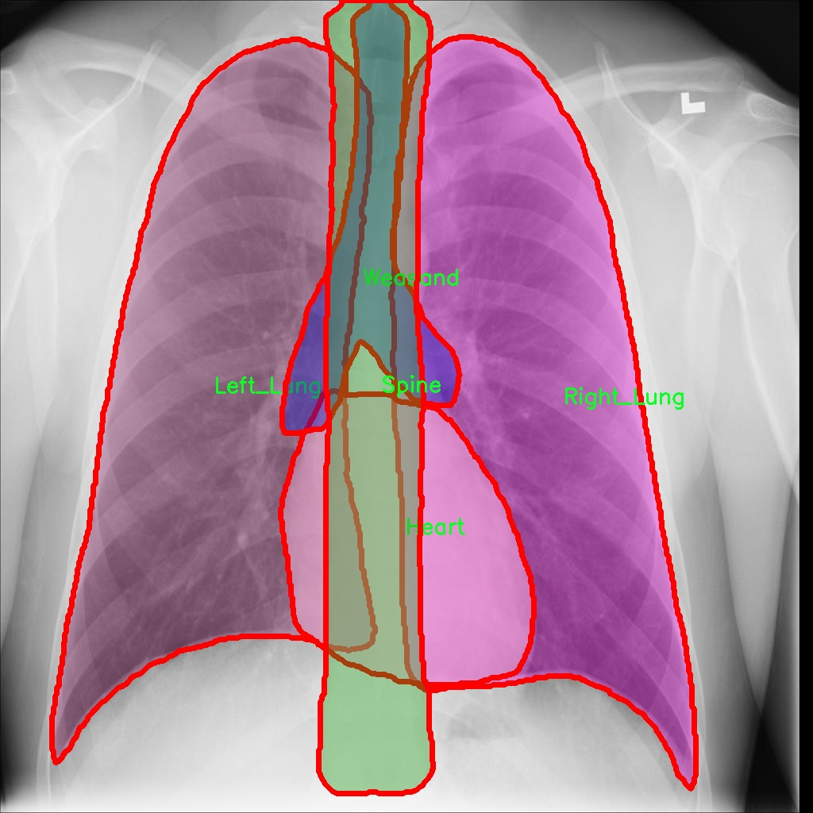
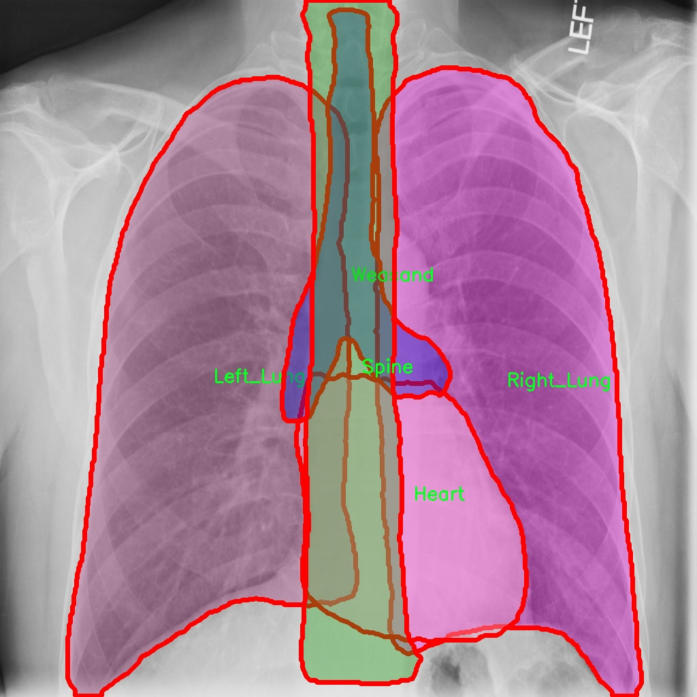
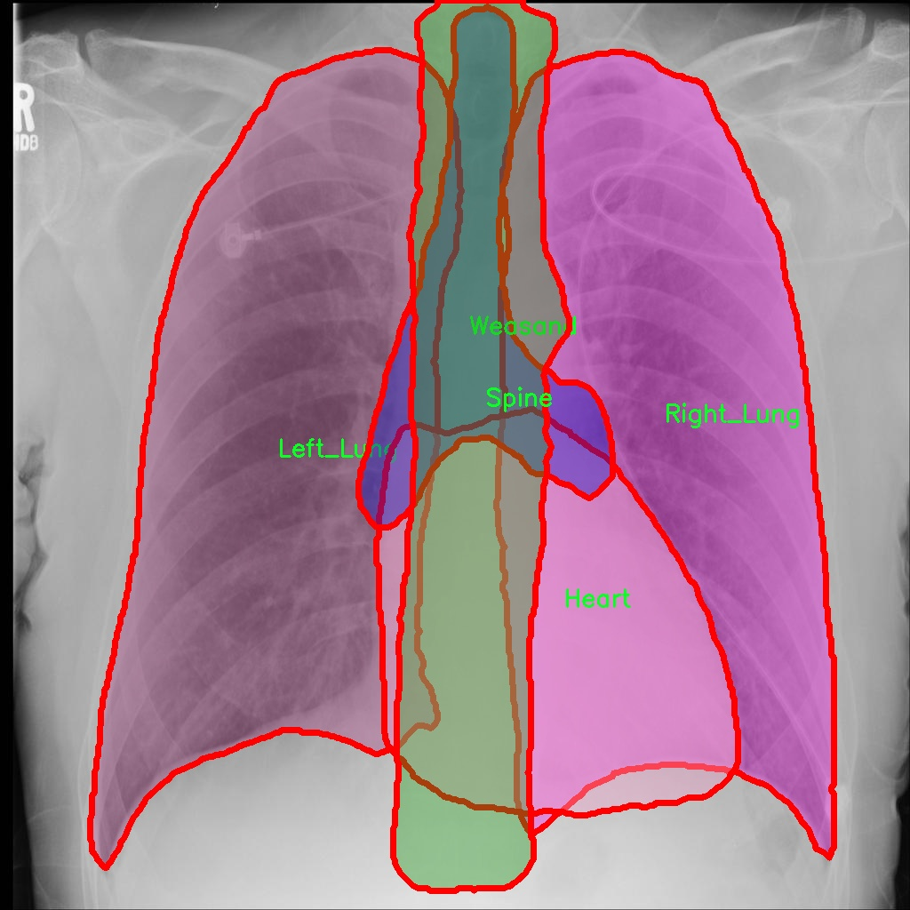
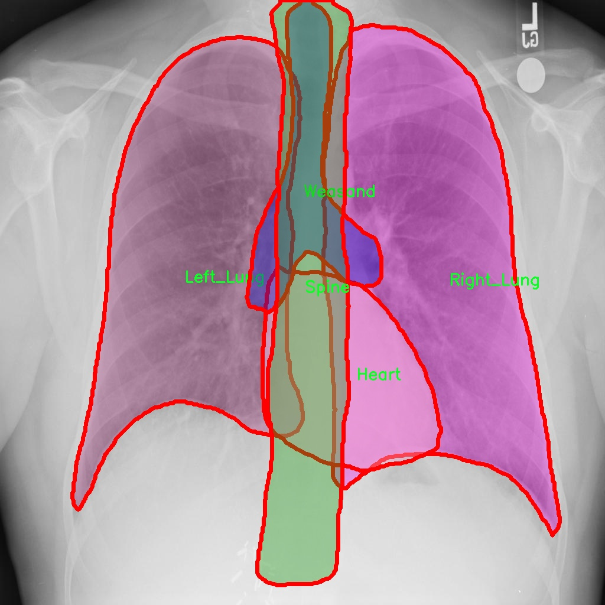
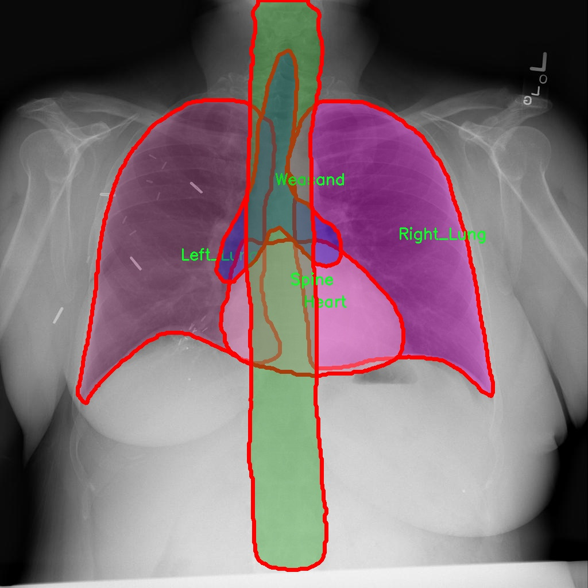

# X光胸片器官图像分割系统源码＆数据集分享
 [yolov8-seg-C2f-DAttention＆yolov8-seg-RepHGNetV2等50+全套改进创新点发刊_一键训练教程_Web前端展示]

### 1.研究背景与意义

项目参考[ILSVRC ImageNet Large Scale Visual Recognition Challenge](https://gitee.com/YOLOv8_YOLOv11_Segmentation_Studio/projects)

项目来源[AAAI Global Al lnnovation Contest](https://kdocs.cn/l/cszuIiCKVNis)

研究背景与意义

随着医疗影像技术的迅猛发展，X光胸片作为一种常见的影像学检查手段，广泛应用于肺部疾病的筛查与诊断。胸片能够提供重要的生理信息，帮助医生识别和评估多种病症，如肺炎、肺结核、肿瘤等。然而，传统的胸片分析往往依赖于医生的经验，存在主观性强、效率低下等问题。因此，基于计算机视觉和深度学习的自动化图像分析技术逐渐成为研究热点，尤其是在器官图像分割领域。

YOLO（You Only Look Once）系列模型因其高效的实时检测能力而受到广泛关注。YOLOv8作为该系列的最新版本，进一步提升了检测精度和速度，适用于复杂的医疗影像分析任务。针对X光胸片的图像分割，改进YOLOv8模型不仅能够提高分割的准确性，还能在多种病症的早期筛查中发挥重要作用。通过对心脏、左右肺、脊柱及气管等关键器官的精确分割，医生能够更快地获取病灶信息，从而做出更为准确的诊断。

本研究所使用的数据集包含2200幅无异常发现的X光胸片图像，涵盖了心脏、左肺、右肺、脊柱和气管五个类别。这一数据集的构建为模型的训练和验证提供了丰富的样本基础，确保了分割模型在实际应用中的可靠性与有效性。通过对这些器官的精确分割，研究将为临床医生提供更为直观的影像分析工具，提升胸片的解读效率。

此外，基于改进YOLOv8的图像分割系统不仅在技术上具有创新性，也在临床应用中具有重要的现实意义。随着人口老龄化和呼吸系统疾病发病率的上升，X光胸片的使用频率逐年增加，传统的人工解读方式已难以满足日益增长的医疗需求。通过引入深度学习技术，自动化的图像分割系统能够显著减轻医生的工作负担，提高诊断效率，进而改善患者的就医体验。

综上所述，基于改进YOLOv8的X光胸片器官图像分割系统的研究，不仅为医疗影像分析提供了一种新的解决方案，也为相关领域的研究提供了新的思路。随着技术的不断进步，未来该系统有望在更广泛的临床场景中得到应用，为实现智能化医疗贡献力量。通过对X光胸片的自动化分析，推动医学影像学的发展，提升医疗服务的质量与效率，最终实现更为精准的个性化医疗。

### 2.图片演示







##### 注意：由于此博客编辑较早，上面“2.图片演示”和“3.视频演示”展示的系统图片或者视频可能为老版本，新版本在老版本的基础上升级如下：（实际效果以升级的新版本为准）

  （1）适配了YOLOV8的“目标检测”模型和“实例分割”模型，通过加载相应的权重（.pt）文件即可自适应加载模型。

  （2）支持“图片识别”、“视频识别”、“摄像头实时识别”三种识别模式。

  （3）支持“图片识别”、“视频识别”、“摄像头实时识别”三种识别结果保存导出，解决手动导出（容易卡顿出现爆内存）存在的问题，识别完自动保存结果并导出到tempDir中。

  （4）支持Web前端系统中的标题、背景图等自定义修改，后面提供修改教程。

  另外本项目提供训练的数据集和训练教程,暂不提供权重文件（best.pt）,需要您按照教程进行训练后实现图片演示和Web前端界面演示的效果。

### 3.视频演示

[3.1 视频演示](https://www.bilibili.com/video/BV1LLSvYWEHC/)

### 4.数据集信息展示

##### 4.1 本项目数据集详细数据（类别数＆类别名）

nc: 5
names: ['Heart', 'Left_Lung', 'Right_Lung', 'Spine', 'Weasand']


##### 4.2 本项目数据集信息介绍

数据集信息展示

在医学影像分析领域，尤其是针对X光胸片的研究，图像分割技术的应用日益受到重视。为了提升YOLOv8-seg模型在X光胸片器官图像分割任务中的表现，我们采用了名为“no-finding”的数据集。该数据集专门设计用于训练和评估图像分割算法，特别是针对胸部器官的精确分割。数据集包含五个主要类别，分别是心脏（Heart）、左肺（Left_Lung）、右肺（Right_Lung）、脊柱（Spine）和气管（Weasand）。这些类别涵盖了胸部X光片中最为关键的解剖结构，能够为后续的医学诊断和治疗提供重要的支持。

“no-finding”数据集的构建遵循了严格的医学标准，确保了数据的高质量和多样性。每个类别的图像均经过专业放射科医生的标注，确保了标注的准确性和一致性。这一过程不仅涉及到图像的选择，还包括对每个器官的边界进行精确的勾勒，以便于后续模型的训练。通过这种方式，数据集能够为YOLOv8-seg模型提供丰富的训练样本，使其在分割任务中具备更强的泛化能力。

在数据集的使用过程中，研究人员可以利用这些标注良好的图像进行监督学习。通过对模型进行反复训练和验证，研究者能够不断优化模型的参数，从而提升其在实际应用中的表现。此外，数据集中的图像样本涵盖了不同年龄、性别和病理状态的患者，使得模型在处理不同类型的X光胸片时，能够更好地适应各种临床场景。

为了进一步提高模型的鲁棒性，研究人员还可以通过数据增强技术对“no-finding”数据集进行扩展。这包括对图像进行旋转、缩放、翻转以及亮度和对比度的调整等操作。这些增强手段不仅能够增加训练样本的多样性，还能有效防止模型的过拟合现象，从而提升其在未知数据上的表现。

在模型训练完成后，研究人员将对其进行评估，主要通过计算分割精度、召回率和F1-score等指标来衡量模型的性能。这些评估指标将为模型的进一步优化提供重要依据，确保其在实际应用中能够达到预期的效果。

总之，“no-finding”数据集为改进YOLOv8-seg的X光胸片器官图像分割系统提供了坚实的基础。通过对该数据集的有效利用，研究人员不仅能够提升模型的分割精度，还能为医学影像分析领域的进一步研究奠定基础。随着技术的不断进步和数据集的不断完善，未来的X光胸片图像分割系统将能够更好地服务于临床实践，为患者的健康管理提供更加精准的支持。











### 5.全套项目环境部署视频教程（零基础手把手教学）

[5.1 环境部署教程链接（零基础手把手教学）](https://www.bilibili.com/video/BV1jG4Ve4E9t/?vd_source=bc9aec86d164b67a7004b996143742dc)


[5.2 安装Python虚拟环境创建和依赖库安装视频教程链接（零基础手把手教学）](https://www.bilibili.com/video/BV1nA4VeYEze/?vd_source=bc9aec86d164b67a7004b996143742dc)

### 6.手把手YOLOV8-seg训练视频教程（零基础小白有手就能学会）

[6.1 手把手YOLOV8-seg训练视频教程（零基础小白有手就能学会）](https://www.bilibili.com/video/BV1cA4VeYETe/?vd_source=bc9aec86d164b67a7004b996143742dc)


按照上面的训练视频教程链接加载项目提供的数据集，运行train.py即可开始训练



     Epoch   gpu_mem       box       obj       cls    labels  img_size
     1/200     0G   0.01576   0.01955  0.007536        22      1280: 100%|██████████| 849/849 [14:42<00:00,  1.04s/it]
               Class     Images     Labels          P          R     mAP@.5 mAP@.5:.95: 100%|██████████| 213/213 [01:14<00:00,  2.87it/s]
                 all       3395      17314      0.994      0.957      0.0957      0.0843

     Epoch   gpu_mem       box       obj       cls    labels  img_size
     2/200     0G   0.01578   0.01923  0.007006        22      1280: 100%|██████████| 849/849 [14:44<00:00,  1.04s/it]
               Class     Images     Labels          P          R     mAP@.5 mAP@.5:.95: 100%|██████████| 213/213 [01:12<00:00,  2.95it/s]
                 all       3395      17314      0.996      0.956      0.0957      0.0845

     Epoch   gpu_mem       box       obj       cls    labels  img_size
     3/200     0G   0.01561    0.0191  0.006895        27      1280: 100%|██████████| 849/849 [10:56<00:00,  1.29it/s]
               Class     Images     Labels          P          R     mAP@.5 mAP@.5:.95: 100%|███████   | 187/213 [00:52<00:00,  4.04it/s]
                 all       3395      17314      0.996      0.957      0.0957      0.0845


### 7.50+种全套YOLOV8-seg创新点代码加载调参视频教程（一键加载写好的改进模型的配置文件）

[7.1 50+种全套YOLOV8-seg创新点代码加载调参视频教程（一键加载写好的改进模型的配置文件）](https://www.bilibili.com/video/BV1Hw4VePEXv/?vd_source=bc9aec86d164b67a7004b996143742dc)

### 8.YOLOV8-seg图像分割算法原理

原始YOLOV8-seg算法原理

YOLOV8-seg作为YOLO系列的最新发展，承载着对目标检测与分割任务的深刻理解与创新。与其前身相比，YOLOV8-seg在算法架构上进行了多项优化，尤其是在处理复杂场景中的小目标时，展现出更为卓越的性能。YOLOV8-seg不仅继承了YOLO系列的高效性和准确性，还在算法设计上引入了多种新技术，以适应日益复杂的应用需求。

首先，YOLOV8-seg的网络结构可以被视为一个四个主要模块的整体：输入端、主干网络、Neck端和输出端。输入端通过Mosaic数据增强、自适应图片缩放和灰度填充等手段，对输入图像进行预处理，以确保模型能够在多样化的环境中保持稳定的性能。此阶段的处理不仅提升了数据的多样性，还为后续的特征提取奠定了基础。

在主干网络中，YOLOV8-seg采用了改进的C2f模块，替代了YOLOv5中的C3模块。C2f模块通过分离卷积和连接操作，增强了特征提取的能力，特别是在保留轻量级特性的同时，促进了梯度流动的信息传递。此设计使得网络能够更有效地捕捉图像中的细节特征，尤其是在复杂背景下的小目标检测中，表现得尤为突出。SPPF模块的引入进一步提升了模型的计算速度，通过多种内核尺寸的池化操作，对特征图进行有效的合并处理，为后续的特征融合提供了丰富的信息。

Neck端的设计采用了路径聚合网络（PAN）结构，结合特征金字塔网络（FPN），实现了多尺度特征的融合。这一结构的优势在于能够有效地整合来自不同层次的特征信息，从而提升网络对不同尺度目标的检测能力。通过上采样和下采样的操作，Neck端不仅增强了语义特征的传递，还确保了定位信息的准确性，使得YOLOV8-seg在复杂环境下的表现更加稳健。

输出端则采用了解耦头结构，允许分类和回归过程的独立优化。这种设计的好处在于，它能够加速模型的收敛速度，同时提升分类和定位的精度。YOLOV8-seg在损失计算上也进行了创新，采用了加权的TaskAlignedAssigner方法，以更好地匹配正负样本，从而提升模型的学习效率和准确性。分类损失使用了二元交叉熵（BCE），而回归损失则结合了分布焦点损失（DFL）和CIoU损失函数，确保了模型在不同任务中的泛化能力。

尽管YOLOV8-seg在许多方面表现出色，但在复杂水面环境下的应用仍然面临挑战。小目标漂浮物的特征复杂且背景多样，导致了定位误差和目标感知能力不足的问题。为了解决这些问题，YOLOV8-seg的改进版本YOLOv8-WSSOD应运而生。该版本引入了BiFormer双层路由注意力机制，构建了C2fBF模块，以减轻主干网络下采样过程中的噪声影响，并保留了更细粒度的上下文信息。此外，针对小目标漏检问题，YOLOv8-WSSOD添加了一个更小的检测头，以提升网络对小目标的感知能力，并在Neck端引入GSConv和Slim-neck技术，以保持精度的同时降低计算量。

在损失函数的选择上，YOLOv8-WSSOD使用了MPDIoU损失函数替代了CIoU损失函数，这一改进显著提高了模型的泛化能力和精准度。MPDIoU损失函数通过引入多种信息度量，能够更全面地评估目标的定位精度，从而进一步提升模型在复杂环境下的表现。

总的来说，YOLOV8-seg及其改进版本在设计理念上体现了对深度学习和计算机视觉领域的深刻理解，通过不断优化网络结构和损失函数，力求在各种复杂场景中实现高效、准确的目标检测与分割。这些创新不仅推动了YOLO系列算法的发展，也为未来的研究提供了新的思路和方向。随着技术的不断进步，YOLOV8-seg无疑将在更多实际应用中展现其强大的能力，助力智能视觉系统的进一步发展。


### 9.系统功能展示（检测对象为举例，实际内容以本项目数据集为准）

图9.1.系统支持检测结果表格显示

  图9.2.系统支持置信度和IOU阈值手动调节

  图9.3.系统支持自定义加载权重文件best.pt(需要你通过步骤5中训练获得)

  图9.4.系统支持摄像头实时识别

  图9.5.系统支持图片识别

  图9.6.系统支持视频识别

  图9.7.系统支持识别结果文件自动保存

  图9.8.系统支持Excel导出检测结果数据


### 10.50+种全套YOLOV8-seg创新点原理讲解（非科班也可以轻松写刊发刊，V11版本正在科研待更新）

#### 10.1 由于篇幅限制，每个创新点的具体原理讲解就不一一展开，具体见下列网址中的创新点对应子项目的技术原理博客网址【Blog】：


[10.1 50+种全套YOLOV8-seg创新点原理讲解链接](https://gitee.com/qunmasj/good)

#### 10.2 部分改进模块原理讲解(完整的改进原理见上图和技术博客链接)【如果此小节的图加载失败可以通过CSDN或者Github搜索该博客的标题访问原始博客，原始博客图片显示正常】
### YOLOv8简介
YOLOv8目标检测算法继承了YOLOv1 系列的思考,是一种新型端到端的目标检测算法,尽管现在原始检测算法已经开源,但是鲜有发表的相关论文.YOLOv8的网络结构如图1[1所示,主要可分为Input输入端、Backbone 骨干神经网络、Neck混合特征网络层和 Head预测层网络共4个部分.

输入端( input)方法包含的功能模块有:马赛克( mosaic)数据增强、自适应锚框( anchor)计算、自适应图片缩放和 Mixup 数据增强['6].马赛克数据增强包括3种方式:缩放,色彩空间调整和马赛克增强.
该方法通过将4张图像进行随机的缩放﹑裁剪和打乱分布方式等操作来重新拼接图像,可丰富检测的数据集,具体步骤可见图2.随机缩放增加的许多小目标,非常适于解决卫星数据往往因距离目标过远从而导致图像中几乎都是小目标这一问题.在自适应锚框计算中, YOLO算法在每次训练数据之前,都会根据标注信息自动计算该数据集最合适的锚框尺寸,然后自动匹配最佳锚框.而自适应图片缩放只在检测时使用,由于不同场景需求不同,因而基于缩放系数YOLOv8提供了多尺度的不同大小模型.Mixup 数据增强鼓励模型对训练样本有一个线性的理解,具体做法是在目标检测中将两幅图像的像素值按照图像透明度的通道信息( alpha值)进行线性融合,对于标签box的处理直接采用拼接( con-cat)的方法拼接到一起.


Backbone骨干网络指用来提取图像特征的网络,整体结构包括注意力机制( focus)模块、跨阶段局部网络[ 7] ( cross stage partial network , CSP)和空间金字塔池化结构( spatial pyramid pooling,SPP).其中, Focus模块的作用是在图片进入 Backbone骨干网络前,对图片进行切片操作,即在一张图片中每隔一个像素取一个值,获得4张互补的图片,最后将新生成的图片经过卷积操作,得到没有信息丢失的2倍下采样特征图.YOLOv8使用了CSPNet 中的C2f网络,网络见图3,其中 CBS 就是卷积层,而瓶颈层( bottleneck layer)使用的是1* 1的卷积神经网络.C2f网络在保证轻量化的同时获得更加丰富的梯度流信息.而SPP结构是空间金字塔池化,能将任意大小的特征图转换成固定大小的特征向量,即把输入的特征地图划分为多个尺度,然后对每个图进行最大池化,再将提取的特征值拼接起来成为一维向量,输入SPP层获取分类.


Neck 结构如图4所示,它是由卷积层和C2f模块组成的的网络层,采用了路径聚合网络( path ag-gregation network ,PAN)和特征金字塔网络( featurepyramid networks , FPN)的结构对特征进行多尺度融合,目标是将图像特征传递到预测层.其中 PAN结构指图4左半边,它自底向上进行下采样,使顶层特征包含图像位置信息,两个特征最后进行融合,使不同尺寸的特征图都包含图像语义信息和图像特征信息，保证了网络对不同尺寸的图片的准确预测.而FPN结构指图4右半边,指通过自顶向下进行上采样,将高层特征与底层特征进行融合,从而同时利用低层特征的高分辨率和高层特征的丰富语义信息,并进行了多尺度特征的独立预测,对小物体的检测效果有明显的提升.从 FPN模块的基础上看,它增加了自底向上的特征金字塔结构,保留了更多的浅层位置特征,将整体特征提取能力进一步提升.


Head的结构如图5所示,在该结构中 YOLOv8采用了解耦检测头( decoupled-head )[ 18],因为分类和定位的关注点不同,分类更关注目标的纹理内容而定位更关注目标的边缘信息.因而解耦头结构考虑到分类和定位所关注的内容的不同,采用不同的分支来进行运算,提升了检测效果,相对应的回归头的通道数也改变了.


### MS-Block简介
实时目标检测，以YOLO系列为例，已在工业领域中找到重要应用，特别是在边缘设备（如无人机和机器人）中。与之前的目标检测器不同，实时目标检测器旨在在速度和准确性之间追求最佳平衡。为了实现这一目标，提出了大量的工作：从第一代DarkNet到CSPNet，再到最近的扩展ELAN，随着性能的快速增长，实时目标检测器的架构经历了巨大的变化。

尽管性能令人印象深刻，但在不同尺度上识别对象仍然是实时目标检测器面临的基本挑战。这促使作者设计了一个强大的编码器架构，用于学习具有表现力的多尺度特征表示。具体而言，作者从两个新的角度考虑为实时目标检测编码多尺度特征：

从局部视角出发，作者设计了一个具有简单而有效的分层特征融合策略的MS-Block。受到Res2Net的启发，作者在MS-Block中引入了多个分支来进行特征提取，但不同的是，作者使用了一个带有深度卷积的 Inverted Bottleneck Block块，以实现对大Kernel的高效利用。

从全局视角出发，作者提出随着网络加深逐渐增加卷积的Kernel-Size。作者在浅层使用小Kernel卷积来更高效地处理高分辨率特征。另一方面，在深层中，作者采用大Kernel卷积来捕捉广泛的信息。

基于以上设计原则，作者呈现了作者的实时目标检测器，称为YOLO-MS。为了评估作者的YOLO-MS的性能，作者在MS COCO数据集上进行了全面的实验。还提供了与其他最先进方法的定量比较，以展示作者方法的强大性能。如图1所示，YOLO-MS在计算性能平衡方面优于其他近期的实时目标检测器。


具体而言，YOLO-MS-XS在MS COCO上获得了43%+的AP得分，仅具有450万个可学习参数和8.7亿个FLOPs。YOLO-MS-S和YOLO-MS分别获得了46%+和51%+的AP，可学习参数分别为810万和2220万。此外，作者的工作还可以作为其他YOLO模型的即插即用模块。通常情况下，作者的方法可以将YOLOv8的AP从37%+显著提高到40%+，甚至还可以使用更少的参数和FLOPs。

CSP Block是一个基于阶段级梯度路径的网络，平衡了梯度组合和计算成本。它是广泛应用于YOLO系列的基本构建块。已经提出了几种变体，包括YOLOv4和YOLOv5中的原始版本，Scaled YOLOv4中的CSPVoVNet，YOLOv7中的ELAN，以及RTMDet中提出的大Kernel单元。作者在图2(a)和图2(b)中分别展示了原始CSP块和ELAN的结构。


上述实时检测器中被忽视的一个关键方面是如何在基本构建块中编码多尺度特征。其中一个强大的设计原则是Res2Net，它聚合了来自不同层次的特征以增强多尺度表示。然而，这一原则并没有充分探索大Kernel卷积的作用，而大Kernel卷积已经在基于CNN的视觉识别任务模型中证明有效。将大Kernel卷积纳入Res2Net的主要障碍在于它们引入的计算开销，因为构建块采用了标准卷积。在作者的方法中，作者提出用 Inverted Bottleneck Block替代标准的3 × 3卷积，以享受大Kernel卷积的好处。

#### MS-Block

基于前面的分析，参考该博客提出了一个带有分层特征融合策略的全新Block，称为MS-Block，以增强实时目标检测器在提取多尺度特征时的能力，同时保持快速的推理速度。

MS-Block的具体结构如图2(c)所示。假设是输入特征。通过1×1卷积的转换后，X的通道维度增加到n*C。然后，作者将X分割成n个不同的组，表示为，其中。为了降低计算成本，作者选择n为3。

注意，除了之外，每个其他组都经过一个 Inverted Bottleneck Block层，用表示，其中k表示Kernel-Size，以获得。的数学表示如下：


根据这个公式，作者不将 Inverted Bottleneck Block层连接到，使其作为跨阶段连接，并保留来自前面层的信息。最后，作者将所有分割连接在一起，并应用1×1卷积来在所有分割之间进行交互，每个分割都编码不同尺度的特征。当网络加深时，这个1×1卷积也用于调整通道数。

#### Heterogeneous Kernel Selection Protocol
除了构建块的设计外，作者还从宏观角度探讨了卷积的使用。之前的实时目标检测器在不同的编码器阶段采用了同质卷积（即具有相同Kernel-Size的卷积），但作者认为这不是提取多尺度语义信息的最佳选项。

在金字塔结构中，从检测器的浅阶段提取的高分辨率特征通常用于捕捉细粒度语义，将用于检测小目标。相反，来自网络较深阶段的低分辨率特征用于捕捉高级语义，将用于检测大目标。如果作者在所有阶段都采用统一的小Kernel卷积，深阶段的有效感受野（ERF）将受到限制，影响大目标的性能。在每个阶段中引入大Kernel卷积可以帮助解决这个问题。然而，具有大的ERF的大Kernel可以编码更广泛的区域，这增加了在小目标外部包含噪声信息的概率，并且降低了推理速度。

在这项工作中，作者建议在不同阶段中采用异构卷积，以帮助捕获更丰富的多尺度特征。具体来说，在编码器的第一个阶段中，作者采用最小Kernel卷积，而最大Kernel卷积位于最后一个阶段。随后，作者逐步增加中间阶段的Kernel-Size，使其与特征分辨率的增加保持一致。这种策略允许提取细粒度和粗粒度的语义信息，增强了编码器的多尺度特征表示能力。

正如图所示，作者将k的值分别分配给编码器中的浅阶段到深阶段，取值为3、5、7和9。作者将其称为异构Kernel选择（HKS）协议。


作者的HKS协议能够在深层中扩大感受野，而不会对浅层产生任何其他影响。第4节的图4支持了作者的分析。此外，HKS不仅有助于编码更丰富的多尺度特征，还确保了高效的推理。

如表1所示，将大Kernel卷积应用于高分辨率特征会产生较高的计算开销。然而，作者的HKS协议在低分辨率特征上采用大Kernel卷积，从而与仅使用大Kernel卷积相比，大大降低了计算成本。


在实践中，作者经验性地发现，采用HKS协议的YOLO-MS的推理速度几乎与仅使用深度可分离的3 × 3卷积相同。


如图所示，作者模型的Backbone由4个阶段组成，每个阶段后面跟随1个步长为2的3 × 3卷积进行下采样。在第3个阶段后，作者添加了1个SPP块，与RTMDet中一样。在作者的编码器上，作者使用PAFPN作为Neck来构建特征金字塔[31, 35]。它融合了从Backbone不同阶段提取的多尺度特征。Neck中使用的基本构建块也是作者的MS-Block，在其中使用3 × 3深度可分离卷积进行快速推理。

此外，为了在速度和准确性之间取得更好的平衡，作者将Backbone中多级特征的通道深度减半。作者提供了3个不同尺度的YOLO-MS变体，即YOLO-MS-XS、YOLO-MS-S和YOLO-MS。不同尺度的YOLO-MS的详细配置列在表2中。对于YOLO-MS的其他部分，作者将其保持与RTMDet相同。


### 11.项目核心源码讲解（再也不用担心看不懂代码逻辑）

#### 11.1 ultralytics\utils\triton.py

以下是对代码的核心部分进行保留和详细注释的版本：

```python
# Ultralytics YOLO 🚀, AGPL-3.0 license

from typing import List
from urllib.parse import urlsplit
import numpy as np

class TritonRemoteModel:
    """
    与远程Triton推理服务器模型交互的客户端。

    属性：
        endpoint (str): Triton服务器上模型的名称。
        url (str): Triton服务器的URL。
        triton_client: Triton客户端（HTTP或gRPC）。
        InferInput: Triton客户端的输入类。
        InferRequestedOutput: Triton客户端的输出请求类。
        input_formats (List[str]): 模型输入的数据类型。
        np_input_formats (List[type]): 模型输入的numpy数据类型。
        input_names (List[str]): 模型输入的名称。
        output_names (List[str]): 模型输出的名称。
    """

    def __init__(self, url: str, endpoint: str = '', scheme: str = ''):
        """
        初始化TritonRemoteModel。

        参数可以单独提供或从形式为
            <scheme>://<netloc>/<endpoint>/<task_name>的集合'url'参数中解析。

        参数：
            url (str): Triton服务器的URL。
            endpoint (str): Triton服务器上模型的名称。
            scheme (str): 通信方案（'http'或'gRPC'）。
        """
        # 如果没有提供endpoint和scheme，则从URL字符串解析所有参数
        if not endpoint and not scheme:
            splits = urlsplit(url)
            endpoint = splits.path.strip('/').split('/')[0]  # 获取模型名称
            scheme = splits.scheme  # 获取通信方案
            url = splits.netloc  # 获取服务器地址

        self.endpoint = endpoint  # 设置模型名称
        self.url = url  # 设置服务器URL

        # 根据通信方案选择Triton客户端
        if scheme == 'http':
            import tritonclient.http as client  # 导入HTTP客户端
            self.triton_client = client.InferenceServerClient(url=self.url, verbose=False, ssl=False)
            config = self.triton_client.get_model_config(endpoint)  # 获取模型配置
        else:
            import tritonclient.grpc as client  # 导入gRPC客户端
            self.triton_client = client.InferenceServerClient(url=self.url, verbose=False, ssl=False)
            config = self.triton_client.get_model_config(endpoint, as_json=True)['config']  # 获取模型配置

        # 按字母顺序排序输出名称
        config['output'] = sorted(config['output'], key=lambda x: x.get('name'))

        # 定义模型属性
        type_map = {'TYPE_FP32': np.float32, 'TYPE_FP16': np.float16, 'TYPE_UINT8': np.uint8}
        self.InferRequestedOutput = client.InferRequestedOutput  # 设置输出请求类
        self.InferInput = client.InferInput  # 设置输入类
        self.input_formats = [x['data_type'] for x in config['input']]  # 获取输入数据类型
        self.np_input_formats = [type_map[x] for x in self.input_formats]  # 转换为numpy数据类型
        self.input_names = [x['name'] for x in config['input']]  # 获取输入名称
        self.output_names = [x['name'] for x in config['output']]  # 获取输出名称

    def __call__(self, *inputs: np.ndarray) -> List[np.ndarray]:
        """
        使用给定的输入调用模型。

        参数：
            *inputs (List[np.ndarray]): 输入数据。

        返回：
            List[np.ndarray]: 模型输出。
        """
        infer_inputs = []  # 存储推理输入
        input_format = inputs[0].dtype  # 获取输入数据类型
        for i, x in enumerate(inputs):
            # 如果输入数据类型与预期不符，则转换数据类型
            if x.dtype != self.np_input_formats[i]:
                x = x.astype(self.np_input_formats[i])
            # 创建InferInput对象并设置数据
            infer_input = self.InferInput(self.input_names[i], [*x.shape], self.input_formats[i].replace('TYPE_', ''))
            infer_input.set_data_from_numpy(x)  # 从numpy数组设置数据
            infer_inputs.append(infer_input)  # 添加到推理输入列表

        # 创建InferRequestedOutput对象以请求输出
        infer_outputs = [self.InferRequestedOutput(output_name) for output_name in self.output_names]
        # 调用Triton客户端进行推理
        outputs = self.triton_client.infer(model_name=self.endpoint, inputs=infer_inputs, outputs=infer_outputs)

        # 返回输出结果，转换为原始输入数据类型
        return [outputs.as_numpy(output_name).astype(input_format) for output_name in self.output_names]
```

### 代码分析
1. **类的定义**：`TritonRemoteModel`类用于与Triton推理服务器进行交互，主要包含模型的基本信息和推理功能。
2. **初始化方法**：在`__init__`方法中，解析URL并初始化Triton客户端，获取模型配置并设置输入输出的相关属性。
3. **调用方法**：`__call__`方法实现了模型的推理过程，接收输入数据，处理数据类型，并返回模型的输出结果。

这个文件定义了一个名为 `TritonRemoteModel` 的类，用于与远程的 Triton 推理服务器模型进行交互。Triton 是一个用于高效部署和推理机器学习模型的服务器。该类的主要功能是封装与 Triton 服务器的通信，简化模型的推理过程。

在类的文档字符串中，列出了该类的主要属性，包括模型的名称、服务器的 URL、Triton 客户端、输入输出的格式和名称等。这些属性为后续的推理操作提供了必要的信息。

类的构造函数 `__init__` 接受三个参数：`url`、`endpoint` 和 `scheme`。如果没有提供 `endpoint` 和 `scheme`，则会从 `url` 中解析出这些信息。解析过程使用了 `urlsplit` 函数，将 URL 分解为不同的部分。接着，根据提供的通信方案（HTTP 或 gRPC），导入相应的 Triton 客户端，并获取模型的配置。

模型的输出名称会按照字母顺序进行排序，以便后续处理。构造函数还定义了输入输出的数据类型映射，确保输入数据的格式与模型的要求相匹配。输入和输出的名称及格式被存储在类的属性中，以便后续使用。

类的 `__call__` 方法允许用户以函数的方式调用模型。该方法接受一个或多个 NumPy 数组作为输入，并返回模型的输出。首先，方法会检查输入数据的类型是否与模型要求的类型一致，如果不一致，则进行类型转换。然后，创建 `InferInput` 对象，将输入数据设置到 Triton 客户端中。接着，构建输出请求，并通过 Triton 客户端进行推理。最后，返回的输出会被转换为原始输入的类型，并以列表的形式返回。

总的来说，这个文件提供了一个简洁的接口，使得用户能够方便地与 Triton 推理服务器进行交互，进行模型推理操作。

#### 11.2 ultralytics\nn\extra_modules\ops_dcnv3\functions\dcnv3_func.py

以下是经过简化和注释的核心代码部分，主要包含了 `DCNv3Function` 类及其前向和反向传播的实现，以及一些辅助函数。注释详细解释了每个部分的功能和作用。

```python
import torch
import torch.nn.functional as F
from torch.autograd import Function
from torch.cuda.amp import custom_bwd, custom_fwd

class DCNv3Function(Function):
    @staticmethod
    @custom_fwd
    def forward(ctx, input, offset, mask, kernel_h, kernel_w, stride_h, stride_w, pad_h, pad_w, dilation_h, dilation_w, group, group_channels, offset_scale, im2col_step, remove_center):
        # 保存前向传播所需的参数到上下文中
        ctx.kernel_h = kernel_h
        ctx.kernel_w = kernel_w
        ctx.stride_h = stride_h
        ctx.stride_w = stride_w
        ctx.pad_h = pad_h
        ctx.pad_w = pad_w
        ctx.dilation_h = dilation_h
        ctx.dilation_w = dilation_w
        ctx.group = group
        ctx.group_channels = group_channels
        ctx.offset_scale = offset_scale
        ctx.im2col_step = im2col_step
        ctx.remove_center = remove_center

        # 准备前向传播的参数
        args = [input, offset, mask, kernel_h, kernel_w, stride_h, stride_w, pad_h, pad_w, dilation_h, dilation_w, group, group_channels, offset_scale, ctx.im2col_step]
        if remove_center:
            args.append(remove_center)

        # 调用 DCNv3 的前向函数
        output = DCNv3.dcnv3_forward(*args)
        ctx.save_for_backward(input, offset, mask)  # 保存输入以备反向传播使用

        return output

    @staticmethod
    @once_differentiable
    @custom_bwd
    def backward(ctx, grad_output):
        # 从上下文中获取保存的张量
        input, offset, mask = ctx.saved_tensors

        # 准备反向传播的参数
        args = [input, offset, mask, ctx.kernel_h, ctx.kernel_w, ctx.stride_h, ctx.stride_w, ctx.pad_h, ctx.pad_w, ctx.dilation_h, ctx.dilation_w, ctx.group, ctx.group_channels, ctx.offset_scale, grad_output.contiguous(), ctx.im2col_step]
        if ctx.remove_center:
            args.append(ctx.remove_center)

        # 调用 DCNv3 的反向函数
        grad_input, grad_offset, grad_mask = DCNv3.dcnv3_backward(*args)

        return grad_input, grad_offset, grad_mask, None, None, None, None, None, None, None, None, None, None, None, None

def _get_reference_points(spatial_shapes, device, kernel_h, kernel_w, dilation_h, dilation_w, pad_h=0, pad_w=0, stride_h=1, stride_w=1):
    # 计算参考点的函数
    _, H_, W_, _ = spatial_shapes
    H_out = (H_ - (dilation_h * (kernel_h - 1) + 1)) // stride_h + 1
    W_out = (W_ - (dilation_w * (kernel_w - 1) + 1)) // stride_w + 1

    # 生成参考点的网格
    ref_y, ref_x = torch.meshgrid(
        torch.linspace((dilation_h * (kernel_h - 1)) // 2 + 0.5, (dilation_h * (kernel_h - 1)) // 2 + 0.5 + (H_out - 1) * stride_h, H_out, dtype=torch.float32, device=device),
        torch.linspace((dilation_w * (kernel_w - 1)) // 2 + 0.5, (dilation_w * (kernel_w - 1)) // 2 + 0.5 + (W_out - 1) * stride_w, W_out, dtype=torch.float32, device=device))
    
    # 归一化参考点
    ref_y = ref_y.reshape(-1)[None] / H_
    ref_x = ref_x.reshape(-1)[None] / W_
    ref = torch.stack((ref_x, ref_y), -1).reshape(1, H_out, W_out, 1, 2)

    return ref

def dcnv3_core_pytorch(input, offset, mask, kernel_h, kernel_w, stride_h, stride_w, pad_h, pad_w, dilation_h, dilation_w, group, group_channels, offset_scale, remove_center):
    # DCNv3 的核心实现，执行卷积操作
    if remove_center and (kernel_h % 2 == 0 or kernel_w % 2 == 0 or kernel_w != kernel_h):
        raise ValueError('remove_center 仅与奇数的方形卷积核兼容。')

    # 对输入进行填充
    input = F.pad(input, [0, 0, pad_h, pad_h, pad_w, pad_w])
    N_, H_in, W_in, _ = input.shape
    _, H_out, W_out, _ = offset.shape

    # 获取参考点和生成膨胀网格
    ref = _get_reference_points(input.shape, input.device, kernel_h, kernel_w, dilation_h, dilation_w, pad_h, pad_w, stride_h, stride_w)
    # 省略了生成膨胀网格的实现细节

    # 计算采样位置
    sampling_locations = (ref + grid * offset_scale).repeat(N_, 1, 1, 1, 1)
    if remove_center:
        sampling_locations = remove_center_sampling_locations(sampling_locations, kernel_w=kernel_w, kernel_h=kernel_h)
    
    # 进行采样并计算输出
    output = (sampling_input_ * mask).sum(-1).view(N_, group * group_channels, H_out * W_out)
    return output.transpose(1, 2).reshape(N_, H_out, W_out, -1).contiguous()
```

### 主要功能说明：
1. **DCNv3Function**: 该类实现了 DCNv3 的前向和反向传播，利用了 PyTorch 的自定义函数功能。
2. **_get_reference_points**: 计算卷积操作中所需的参考点，用于生成采样位置。
3. **dcnv3_core_pytorch**: 实现了 DCNv3 的核心卷积操作，包括输入填充、参考点计算和最终输出的生成。

### 注意事项：
- 代码中涉及到的 DCNv3 的具体实现细节（如 `DCNv3.dcnv3_forward` 和 `DCNv3.dcnv3_backward`）未在此处提供，假设这些函数在其他地方定义并实现。
- 该实现依赖于 PyTorch 的自动求导机制，适用于深度学习模型的训练和推理。

这个程序文件 `dcnv3_func.py` 实现了 DCNv3（Deformable Convolutional Networks v3）中的一些核心功能，主要用于在深度学习模型中进行可变形卷积操作。该文件使用 PyTorch 框架，并包含前向和反向传播的实现。

首先，文件中引入了一些必要的库，包括 PyTorch 和一些功能性模块。`DCNv3Function` 类继承自 `torch.autograd.Function`，它定义了可变形卷积的前向和反向传播方法。通过使用 `@custom_fwd` 和 `@custom_bwd` 装饰器，前向和反向传播的操作可以被自定义，以便更好地利用 GPU 加速。

在 `forward` 方法中，输入参数包括输入张量、偏移量、掩码以及卷积核的各种参数（如大小、步幅、填充等）。该方法首先将这些参数存储在上下文中，以便在反向传播时使用。然后，它调用 `DCNv3.dcnv3_forward` 函数执行前向计算，并返回输出结果。

`backward` 方法实现了反向传播，计算梯度。它从上下文中恢复保存的张量，并调用 `DCNv3.dcnv3_backward` 函数来计算输入、偏移量和掩码的梯度。

此外，文件中还定义了一些辅助函数，例如 `_get_reference_points` 和 `_generate_dilation_grids`，用于生成参考点和膨胀网格。这些函数通过计算空间形状和卷积参数，生成在卷积操作中需要的采样位置。

`remove_center_sampling_locations` 函数用于移除中心采样位置，确保在某些情况下的采样位置符合要求。`dcnv3_core_pytorch` 函数则是实现可变形卷积的核心逻辑，包括输入的填充、参考点的计算、采样位置的生成以及最终的输出计算。

总的来说，这个文件实现了 DCNv3 中的可变形卷积操作，提供了前向和反向传播的功能，能够在深度学习模型中灵活应用，以提高模型对形状变化的适应能力。

#### 11.3 ultralytics\utils\callbacks\mlflow.py

以下是经过简化和注释的核心代码部分，主要保留了与 MLflow 日志记录相关的功能：

```python
# 导入必要的库
from ultralytics.utils import LOGGER, RUNS_DIR, SETTINGS, TESTS_RUNNING, colorstr

try:
    import os
    import mlflow  # 导入 MLflow 库

    # 确保在测试环境中不记录日志
    assert not TESTS_RUNNING or 'test_mlflow' in os.environ.get('PYTEST_CURRENT_TEST', '')
    # 确保 MLflow 集成已启用
    assert SETTINGS['mlflow'] is True  
    assert hasattr(mlflow, '__version__')  # 确保 mlflow 包已正确导入

    PREFIX = colorstr('MLflow: ')  # 设置日志前缀

except (ImportError, AssertionError):
    mlflow = None  # 如果导入失败，则将 mlflow 设置为 None


def on_pretrain_routine_end(trainer):
    """
    在预训练例程结束时记录训练参数到 MLflow。

    参数:
        trainer (ultralytics.engine.trainer.BaseTrainer): 包含要记录的参数的训练对象。

    全局变量:
        mlflow: 用于记录的 MLflow 模块。

    环境变量:
        MLFLOW_TRACKING_URI: MLflow 跟踪的 URI，默认为 'runs/mlflow'。
        MLFLOW_EXPERIMENT_NAME: MLflow 实验的名称，默认为 trainer.args.project。
        MLFLOW_RUN: MLflow 运行的名称，默认为 trainer.args.name。
    """
    global mlflow

    # 获取跟踪 URI
    uri = os.environ.get('MLFLOW_TRACKING_URI') or str(RUNS_DIR / 'mlflow')
    LOGGER.debug(f'{PREFIX} tracking uri: {uri}')
    mlflow.set_tracking_uri(uri)  # 设置 MLflow 跟踪 URI

    # 设置实验和运行名称
    experiment_name = os.environ.get('MLFLOW_EXPERIMENT_NAME') or trainer.args.project or '/Shared/YOLOv8'
    run_name = os.environ.get('MLFLOW_RUN') or trainer.args.name
    mlflow.set_experiment(experiment_name)  # 设置实验名称

    mlflow.autolog()  # 启用自动日志记录
    try:
        # 开始一个新的运行
        active_run = mlflow.active_run() or mlflow.start_run(run_name=run_name)
        LOGGER.info(f'{PREFIX}logging run_id({active_run.info.run_id}) to {uri}')
        # 提示用户查看日志
        LOGGER.info(f"{PREFIX}view at http://127.0.0.1:5000 with 'mlflow server --backend-store-uri {uri}'")
        LOGGER.info(f"{PREFIX}disable with 'yolo settings mlflow=False'")
        mlflow.log_params(dict(trainer.args))  # 记录训练参数
    except Exception as e:
        LOGGER.warning(f'{PREFIX}WARNING ⚠️ Failed to initialize: {e}\n'
                       f'{PREFIX}WARNING ⚠️ Not tracking this run')


def on_fit_epoch_end(trainer):
    """在每个训练周期结束时记录训练指标到 MLflow。"""
    if mlflow:
        # 清理指标名称并记录
        sanitized_metrics = {k.replace('(', '').replace(')', ''): float(v) for k, v in trainer.metrics.items()}
        mlflow.log_metrics(metrics=sanitized_metrics, step=trainer.epoch)


def on_train_end(trainer):
    """在训练结束时记录模型工件。"""
    if mlflow:
        # 记录最佳模型和其他文件
        mlflow.log_artifact(str(trainer.best.parent))  # 记录最佳模型的目录
        for f in trainer.save_dir.glob('*'):  # 记录保存目录中的所有文件
            if f.suffix in {'.png', '.jpg', '.csv', '.pt', '.yaml'}:
                mlflow.log_artifact(str(f))

        mlflow.end_run()  # 结束当前运行
        LOGGER.info(f'{PREFIX}results logged to {mlflow.get_tracking_uri()}\n'
                    f"{PREFIX}disable with 'yolo settings mlflow=False'")


# 定义回调函数字典
callbacks = {
    'on_pretrain_routine_end': on_pretrain_routine_end,
    'on_fit_epoch_end': on_fit_epoch_end,
    'on_train_end': on_train_end} if mlflow else {}
```

### 代码说明：
1. **导入库**：导入必要的库和模块，包括 `mlflow`，用于记录实验的相关信息。
2. **环境变量和设置**：通过环境变量设置 MLflow 的跟踪 URI、实验名称和运行名称。
3. **记录训练参数**：在预训练结束时，记录训练参数到 MLflow。
4. **记录训练指标**：在每个训练周期结束时，记录当前的训练指标。
5. **记录模型工件**：在训练结束时，记录模型的相关文件和最佳模型。
6. **回调函数**：定义了在不同训练阶段调用的回调函数，用于自动记录相关信息。

这个程序文件是用于Ultralytics YOLO模型的MLflow日志记录功能。MLflow是一个开源平台，用于管理机器学习生命周期，包括实验跟踪、模型管理和部署等。该模块的主要作用是记录训练过程中的各种参数、指标和模型工件，以便后续分析和可视化。

文件开头包含了一些基本信息和使用说明，包括如何设置项目名称、运行名称、启动本地MLflow服务器以及如何终止正在运行的MLflow服务器实例。这些命令通过环境变量或参数传递给程序，以便用户可以灵活配置。

在代码中，首先导入了一些必要的模块和常量，包括日志记录器、运行目录、设置和颜色字符串。接着，尝试导入MLflow模块，并进行了一些基本的验证，如检查是否在测试环境中运行以及MLflow集成是否启用。如果导入失败或验证不通过，则将mlflow设置为None。

接下来的三个函数分别对应训练过程中的不同阶段：

1. **on_pretrain_routine_end**：在预训练例程结束时记录训练参数。该函数根据环境变量和训练器的参数设置MLflow的跟踪URI、实验名称和运行名称。如果没有活动的运行，则启动一个新的MLflow运行。最后，它会记录训练器的参数。如果在初始化过程中出现异常，则会记录警告信息。

2. **on_fit_epoch_end**：在每个训练周期结束时记录训练指标。它会清理指标的名称，去掉括号，并将指标值转换为浮点数，然后将这些指标记录到MLflow中。

3. **on_train_end**：在训练结束时记录模型工件。它会记录最佳模型的目录及其他保存的文件（如图像、CSV、模型权重等），并结束当前的MLflow运行。

最后，代码定义了一个回调字典，包含了上述三个函数，只有在成功导入MLflow的情况下才会被定义。这样，程序在训练过程中可以自动调用这些回调函数，确保所有重要的信息都被记录到MLflow中，以便后续的分析和可视化。

#### 11.4 ultralytics\models\yolo\detect\train.py

以下是代码中最核心的部分，并附上详细的中文注释：

```python
from ultralytics.data import build_dataloader, build_yolo_dataset
from ultralytics.engine.trainer import BaseTrainer
from ultralytics.models import yolo
from ultralytics.nn.tasks import DetectionModel
from ultralytics.utils import LOGGER, RANK
from ultralytics.utils.torch_utils import de_parallel, torch_distributed_zero_first

class DetectionTrainer(BaseTrainer):
    """
    DetectionTrainer类，继承自BaseTrainer类，用于基于检测模型的训练。
    """

    def build_dataset(self, img_path, mode='train', batch=None):
        """
        构建YOLO数据集。

        参数:
            img_path (str): 包含图像的文件夹路径。
            mode (str): 模式，可以是'train'或'val'，用户可以为每种模式自定义不同的增强。
            batch (int, optional): 批次大小，仅适用于'rect'模式。默认为None。
        """
        gs = max(int(de_parallel(self.model).stride.max() if self.model else 0), 32)  # 获取模型的最大步幅
        return build_yolo_dataset(self.args, img_path, batch, self.data, mode=mode, rect=mode == 'val', stride=gs)

    def get_dataloader(self, dataset_path, batch_size=16, rank=0, mode='train'):
        """构造并返回数据加载器。"""
        assert mode in ['train', 'val']  # 确保模式是'train'或'val'
        with torch_distributed_zero_first(rank):  # 在分布式环境中仅初始化一次数据集
            dataset = self.build_dataset(dataset_path, mode, batch_size)  # 构建数据集
        shuffle = mode == 'train'  # 训练模式下打乱数据
        if getattr(dataset, 'rect', False) and shuffle:
            LOGGER.warning("WARNING ⚠️ 'rect=True'与DataLoader的shuffle不兼容，设置shuffle=False")
            shuffle = False  # 如果是'rect'模式且需要打乱，则不打乱
        workers = self.args.workers if mode == 'train' else self.args.workers * 2  # 设置工作线程数
        return build_dataloader(dataset, batch_size, workers, shuffle, rank)  # 返回数据加载器

    def preprocess_batch(self, batch):
        """对一批图像进行预处理，包括缩放和转换为浮点数。"""
        batch['img'] = batch['img'].to(self.device, non_blocking=True).float() / 255  # 将图像数据转移到设备并归一化
        return batch

    def set_model_attributes(self):
        """设置模型的属性，包括类别数量和名称。"""
        self.model.nc = self.data['nc']  # 将类别数量附加到模型
        self.model.names = self.data['names']  # 将类别名称附加到模型
        self.model.args = self.args  # 将超参数附加到模型

    def get_model(self, cfg=None, weights=None, verbose=True):
        """返回YOLO检测模型。"""
        model = DetectionModel(cfg, nc=self.data['nc'], verbose=verbose and RANK == -1)  # 创建检测模型
        if weights:
            model.load(weights)  # 加载权重
        return model

    def get_validator(self):
        """返回用于YOLO模型验证的DetectionValidator。"""
        self.loss_names = 'box_loss', 'cls_loss', 'dfl_loss'  # 定义损失名称
        return yolo.detect.DetectionValidator(self.test_loader, save_dir=self.save_dir, args=copy(self.args))  # 返回验证器

    def plot_training_samples(self, batch, ni):
        """绘制带有注释的训练样本。"""
        plot_images(images=batch['img'],
                    batch_idx=batch['batch_idx'],
                    cls=batch['cls'].squeeze(-1),
                    bboxes=batch['bboxes'],
                    paths=batch['im_file'],
                    fname=self.save_dir / f'train_batch{ni}.jpg',
                    on_plot=self.on_plot)  # 保存训练样本图像

    def plot_metrics(self):
        """绘制来自CSV文件的指标。"""
        plot_results(file=self.csv, on_plot=self.on_plot)  # 保存结果图像
```

### 代码说明：
1. **类定义**：`DetectionTrainer`类是用于YOLO模型训练的核心类，继承自`BaseTrainer`。
2. **数据集构建**：`build_dataset`方法用于构建YOLO数据集，支持训练和验证模式。
3. **数据加载器**：`get_dataloader`方法构造数据加载器，支持分布式训练。
4. **数据预处理**：`preprocess_batch`方法对输入的图像批次进行预处理。
5. **模型属性设置**：`set_model_attributes`方法设置模型的类别数量和名称。
6. **模型获取**：`get_model`方法返回YOLO检测模型，并可加载预训练权重。
7. **验证器获取**：`get_validator`方法返回用于模型验证的验证器。
8. **可视化**：`plot_training_samples`和`plot_metrics`方法用于可视化训练样本和训练指标。

这个程序文件是Ultralytics YOLO（You Only Look Once）模型的训练模块，主要用于目标检测任务。文件中定义了一个名为`DetectionTrainer`的类，该类继承自`BaseTrainer`，专门用于基于YOLO模型的训练。

在文件开头，导入了一些必要的库和模块，包括数据处理、模型构建、训练器基类、日志记录等。接下来，`DetectionTrainer`类的文档字符串提供了一个简单的示例，展示了如何使用该类进行训练。

`DetectionTrainer`类中包含多个方法。`build_dataset`方法用于构建YOLO数据集，接受图像路径、模式（训练或验证）和批次大小作为参数。它会根据模型的步幅计算图像的最小尺寸，并调用`build_yolo_dataset`函数来创建数据集。

`get_dataloader`方法用于构建和返回数据加载器。它首先检查模式是否为训练或验证，然后在分布式训练的情况下，确保数据集只初始化一次。根据模式决定是否打乱数据，并设置工作线程的数量，最后返回构建好的数据加载器。

`preprocess_batch`方法负责对一批图像进行预处理，包括将图像转换为浮点数并缩放到0到1之间。

`set_model_attributes`方法用于设置模型的属性，包括类别数量、类别名称和超参数等。

`get_model`方法返回一个YOLO检测模型，支持加载预训练权重。

`get_validator`方法返回一个用于模型验证的`DetectionValidator`实例，记录损失名称以便后续分析。

`label_loss_items`方法返回一个包含训练损失项的字典，便于后续记录和分析。

`progress_string`方法生成一个格式化的字符串，显示训练进度，包括当前的epoch、GPU内存使用情况、损失值、实例数量和图像大小。

`plot_training_samples`方法用于绘制训练样本及其标注，便于可视化训练过程。

最后，`plot_metrics`和`plot_training_labels`方法分别用于绘制训练过程中的指标和标签，帮助用户更好地理解模型的训练效果。

总体而言，这个文件实现了YOLO模型训练的核心功能，包括数据集构建、数据加载、模型设置、训练过程监控和结果可视化等，便于用户进行目标检测任务的训练和评估。

#### 11.5 ultralytics\engine\predictor.py

以下是代码中最核心的部分，并附上详细的中文注释：

```python
class BasePredictor:
    """
    BasePredictor类用于创建预测器的基类。

    属性:
        args (SimpleNamespace): 预测器的配置。
        save_dir (Path): 保存结果的目录。
        model (nn.Module): 用于预测的模型。
        device (torch.device): 用于预测的设备。
        dataset (Dataset): 用于预测的数据集。
    """

    def __init__(self, cfg=DEFAULT_CFG, overrides=None, _callbacks=None):
        """
        初始化BasePredictor类。

        参数:
            cfg (str, optional): 配置文件的路径，默认为DEFAULT_CFG。
            overrides (dict, optional): 配置覆盖，默认为None。
        """
        self.args = get_cfg(cfg, overrides)  # 获取配置
        self.save_dir = get_save_dir(self.args)  # 获取保存目录
        self.done_warmup = False  # 是否完成预热
        self.model = None  # 模型初始化为None
        self.device = None  # 设备初始化为None
        self.dataset = None  # 数据集初始化为None
        self.callbacks = _callbacks or callbacks.get_default_callbacks()  # 获取回调函数

    def preprocess(self, im):
        """
        在推理之前准备输入图像。

        参数:
            im (torch.Tensor | List(np.ndarray)): 输入图像，支持张量或列表格式。
        
        返回:
            torch.Tensor: 处理后的图像张量。
        """
        not_tensor = not isinstance(im, torch.Tensor)  # 检查输入是否为张量
        if not_tensor:
            im = np.stack(self.pre_transform(im))  # 预处理图像
            im = im[..., ::-1].transpose((0, 3, 1, 2))  # BGR转RGB，调整维度
            im = np.ascontiguousarray(im)  # 确保数组是连续的
            im = torch.from_numpy(im)  # 转换为张量

        im = im.to(self.device)  # 移动到指定设备
        im = im.half() if self.model.fp16 else im.float()  # 转换数据类型
        if not_tensor:
            im /= 255  # 归一化到[0, 1]
        return im

    def inference(self, im, *args, **kwargs):
        """对给定图像进行推理。"""
        return self.model(im, augment=self.args.augment)  # 使用模型进行推理

    def stream_inference(self, source=None, model=None, *args, **kwargs):
        """实时推理摄像头输入并将结果保存到文件。"""
        if not self.model:
            self.setup_model(model)  # 设置模型

        self.setup_source(source if source is not None else self.args.source)  # 设置数据源

        for batch in self.dataset:  # 遍历数据集
            path, im0s, vid_cap, s = batch  # 获取批次数据
            im = self.preprocess(im0s)  # 预处理图像
            preds = self.inference(im, *args, **kwargs)  # 进行推理
            self.results = self.postprocess(preds, im, im0s)  # 后处理结果

            for i in range(len(im0s)):
                self.write_results(i, self.results, (path[i], im, im0s[i]))  # 写入结果

            yield from self.results  # 生成结果

    def setup_model(self, model, verbose=True):
        """初始化YOLO模型并设置为评估模式。"""
        self.model = AutoBackend(model or self.args.model, device=select_device(self.args.device))  # 设置模型
        self.device = self.model.device  # 更新设备
        self.model.eval()  # 设置为评估模式

    def write_results(self, idx, results, batch):
        """将推理结果写入文件或目录。"""
        p, im, _ = batch  # 获取批次数据
        result = results[idx]  # 获取当前结果
        # 处理保存逻辑
        if self.args.save_txt:
            result.save_txt(f'{self.save_dir}/labels/{p.stem}.txt')  # 保存文本结果
        # 其他保存逻辑...
```

### 代码核心部分说明：
1. **BasePredictor类**：这是一个用于图像推理的基类，包含了模型初始化、数据预处理、推理、后处理和结果保存等功能。
2. **__init__方法**：初始化类的属性，包括配置、保存目录、模型、设备等。
3. **preprocess方法**：对输入图像进行预处理，包括格式转换和归一化。
4. **inference方法**：使用模型对预处理后的图像进行推理。
5. **stream_inference方法**：实现实时推理功能，处理视频流或摄像头输入。
6. **setup_model方法**：初始化YOLO模型并设置为评估模式。
7. **write_results方法**：将推理结果写入文件或目录，支持保存文本结果等。

这些方法和属性构成了图像推理的核心逻辑，能够处理不同来源的输入并输出推理结果。

这个程序文件是一个用于运行YOLO（You Only Look Once）目标检测模型的预测器，文件名为`predictor.py`，它是Ultralytics YOLO库的一部分。该文件的主要功能是处理图像、视频、网络摄像头等多种输入源，并对其进行目标检测。

首先，文件开头包含了使用说明，说明了如何通过命令行调用该预测器，支持的输入源包括摄像头、图像文件、视频文件、目录、YouTube链接等。此外，还列出了支持的模型格式，如PyTorch、ONNX、TensorRT等。

接下来，文件导入了一些必要的库，包括`cv2`（OpenCV）、`numpy`和`torch`，以及Ultralytics库中的一些模块。`BasePredictor`类是该文件的核心类，负责初始化和执行预测。它的构造函数接收配置文件路径和一些覆盖参数，并初始化相关属性，如保存结果的目录、模型、数据配置等。

在`BasePredictor`类中，有多个方法用于处理图像和视频的预测过程。`preprocess`方法用于在推理前对输入图像进行预处理，包括调整图像大小和格式转换。`inference`方法则执行模型推理，返回预测结果。`postprocess`方法用于对模型的输出进行后处理，通常是将模型的原始输出转换为可用的格式。

该类还提供了`__call__`方法，使得实例可以像函数一样被调用，执行预测。`setup_source`方法用于设置输入源和推理模式，确保输入数据的正确性。`stream_inference`方法则用于实时流式推理，适用于摄像头或视频流。

此外，`write_results`方法负责将推理结果写入文件或显示在图像上。`show`方法用于在窗口中显示图像，`save_preds`方法则用于将预测结果保存为视频文件。

最后，`run_callbacks`和`add_callback`方法用于管理回调函数，这些回调可以在特定事件发生时执行，以便于扩展和自定义预测过程。

总的来说，这个文件提供了一个灵活的框架，用于处理不同类型的输入数据，并使用YOLO模型进行目标检测，适用于各种应用场景。

### 12.系统整体结构（节选）

### 整体功能和构架概括

Ultralytics YOLO项目是一个用于目标检测的深度学习框架，提供了从模型训练到推理的完整流程。其整体架构包括多个模块，每个模块负责特定的功能。主要功能包括：

1. **模型训练**：通过`train.py`模块，用户可以配置和启动YOLO模型的训练过程，支持多种数据集和训练参数的设置。
2. **可变形卷积**：`dcnv3_func.py`模块实现了DCNv3（Deformable Convolutional Networks v3）的核心功能，提供了可变形卷积的前向和反向传播计算。
3. **推理和预测**：`predictor.py`模块负责处理图像、视频等输入源，并使用训练好的YOLO模型进行目标检测，支持实时推理和结果可视化。
4. **回调和日志记录**：`mlflow.py`模块集成了MLflow，用于记录训练过程中的参数、指标和模型工件，便于后续分析和可视化。
5. **与Triton服务器的交互**：`triton.py`模块提供了与Triton推理服务器的接口，允许用户通过远程调用进行模型推理。

### 文件功能整理表

| 文件路径                                                      | 功能描述                                                                                     |
|-----------------------------------------------------------|------------------------------------------------------------------------------------------|
| `ultralytics/utils/triton.py`                             | 封装与Triton推理服务器的交互，简化模型推理过程，支持输入输出格式的管理。                             |
| `ultralytics/nn/extra_modules/ops_dcnv3/functions/dcnv3_func.py` | 实现DCNv3可变形卷积的前向和反向传播计算，提供辅助函数用于生成参考点和膨胀网格。                     |
| `ultralytics/utils/callbacks/mlflow.py`                  | 集成MLflow用于记录训练过程中的参数、指标和模型工件，支持实验跟踪和结果可视化。                     |
| `ultralytics/models/yolo/detect/train.py`                | 实现YOLO模型的训练过程，包括数据集构建、数据加载、模型设置和训练监控等功能。                     |
| `ultralytics/engine/predictor.py`                         | 处理图像、视频等输入源并执行YOLO模型的目标检测，支持实时推理和结果的可视化。                     |

这个表格总结了每个文件的主要功能，展示了Ultralytics YOLO项目的模块化设计，使得用户能够灵活地进行目标检测任务的训练和推理。

注意：由于此博客编辑较早，上面“11.项目核心源码讲解（再也不用担心看不懂代码逻辑）”中部分代码可能会优化升级，仅供参考学习，完整“训练源码”、“Web前端界面”和“50+种创新点源码”以“14.完整训练+Web前端界面+50+种创新点源码、数据集获取”的内容为准。

### 13.图片、视频、摄像头图像分割Demo(去除WebUI)代码

在这个博客小节中，我们将讨论如何在不使用WebUI的情况下，实现图像分割模型的使用。本项目代码已经优化整合，方便用户将分割功能嵌入自己的项目中。
核心功能包括图片、视频、摄像头图像的分割，ROI区域的轮廓提取、类别分类、周长计算、面积计算、圆度计算以及颜色提取等。
这些功能提供了良好的二次开发基础。

### 核心代码解读

以下是主要代码片段，我们会为每一块代码进行详细的批注解释：

```python
import random
import cv2
import numpy as np
from PIL import ImageFont, ImageDraw, Image
from hashlib import md5
from model import Web_Detector
from chinese_name_list import Label_list

# 根据名称生成颜色
def generate_color_based_on_name(name):
    ......

# 计算多边形面积
def calculate_polygon_area(points):
    return cv2.contourArea(points.astype(np.float32))

...
# 绘制中文标签
def draw_with_chinese(image, text, position, font_size=20, color=(255, 0, 0)):
    image_pil = Image.fromarray(cv2.cvtColor(image, cv2.COLOR_BGR2RGB))
    draw = ImageDraw.Draw(image_pil)
    font = ImageFont.truetype("simsun.ttc", font_size, encoding="unic")
    draw.text(position, text, font=font, fill=color)
    return cv2.cvtColor(np.array(image_pil), cv2.COLOR_RGB2BGR)

# 动态调整参数
def adjust_parameter(image_size, base_size=1000):
    max_size = max(image_size)
    return max_size / base_size

# 绘制检测结果
def draw_detections(image, info, alpha=0.2):
    name, bbox, conf, cls_id, mask = info['class_name'], info['bbox'], info['score'], info['class_id'], info['mask']
    adjust_param = adjust_parameter(image.shape[:2])
    spacing = int(20 * adjust_param)

    if mask is None:
        x1, y1, x2, y2 = bbox
        aim_frame_area = (x2 - x1) * (y2 - y1)
        cv2.rectangle(image, (x1, y1), (x2, y2), color=(0, 0, 255), thickness=int(3 * adjust_param))
        image = draw_with_chinese(image, name, (x1, y1 - int(30 * adjust_param)), font_size=int(35 * adjust_param))
        y_offset = int(50 * adjust_param)  # 类别名称上方绘制，其下方留出空间
    else:
        mask_points = np.concatenate(mask)
        aim_frame_area = calculate_polygon_area(mask_points)
        mask_color = generate_color_based_on_name(name)
        try:
            overlay = image.copy()
            cv2.fillPoly(overlay, [mask_points.astype(np.int32)], mask_color)
            image = cv2.addWeighted(overlay, 0.3, image, 0.7, 0)
            cv2.drawContours(image, [mask_points.astype(np.int32)], -1, (0, 0, 255), thickness=int(8 * adjust_param))

            # 计算面积、周长、圆度
            area = cv2.contourArea(mask_points.astype(np.int32))
            perimeter = cv2.arcLength(mask_points.astype(np.int32), True)
            ......

            # 计算色彩
            mask = np.zeros(image.shape[:2], dtype=np.uint8)
            cv2.drawContours(mask, [mask_points.astype(np.int32)], -1, 255, -1)
            color_points = cv2.findNonZero(mask)
            ......

            # 绘制类别名称
            x, y = np.min(mask_points, axis=0).astype(int)
            image = draw_with_chinese(image, name, (x, y - int(30 * adjust_param)), font_size=int(35 * adjust_param))
            y_offset = int(50 * adjust_param)

            # 绘制面积、周长、圆度和色彩值
            metrics = [("Area", area), ("Perimeter", perimeter), ("Circularity", circularity), ("Color", color_str)]
            for idx, (metric_name, metric_value) in enumerate(metrics):
                ......

    return image, aim_frame_area

# 处理每帧图像
def process_frame(model, image):
    pre_img = model.preprocess(image)
    pred = model.predict(pre_img)
    det = pred[0] if det is not None and len(det)
    if det:
        det_info = model.postprocess(pred)
        for info in det_info:
            image, _ = draw_detections(image, info)
    return image

if __name__ == "__main__":
    cls_name = Label_list
    model = Web_Detector()
    model.load_model("./weights/yolov8s-seg.pt")

    # 摄像头实时处理
    cap = cv2.VideoCapture(0)
    while cap.isOpened():
        ret, frame = cap.read()
        if not ret:
            break
        ......

    # 图片处理
    image_path = './icon/OIP.jpg'
    image = cv2.imread(image_path)
    if image is not None:
        processed_image = process_frame(model, image)
        ......

    # 视频处理
    video_path = ''  # 输入视频的路径
    cap = cv2.VideoCapture(video_path)
    while cap.isOpened():
        ret, frame = cap.read()
        ......
```


### 14.完整训练+Web前端界面+50+种创新点源码、数据集获取


# [下载链接：https://mbd.pub/o/bread/Zp6Yk51v](https://mbd.pub/o/bread/Zp6Yk51v)